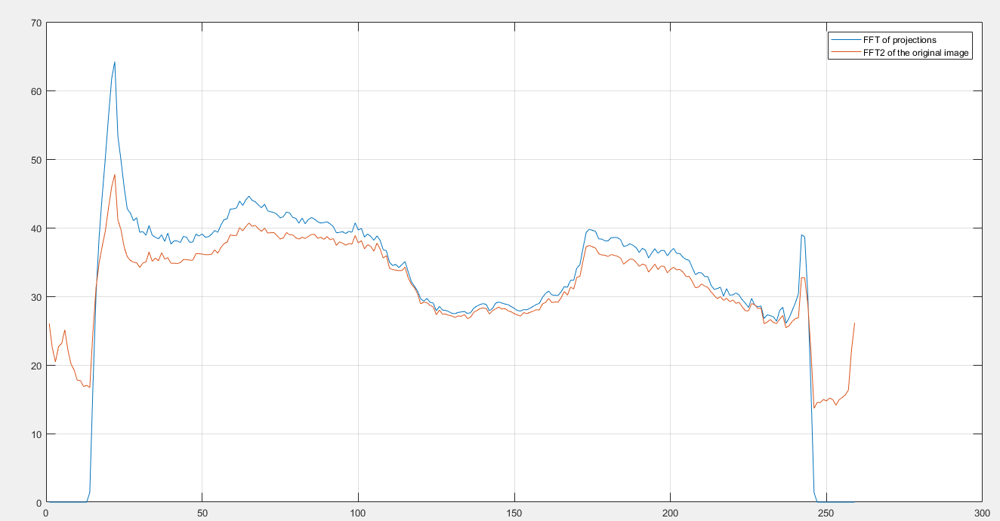
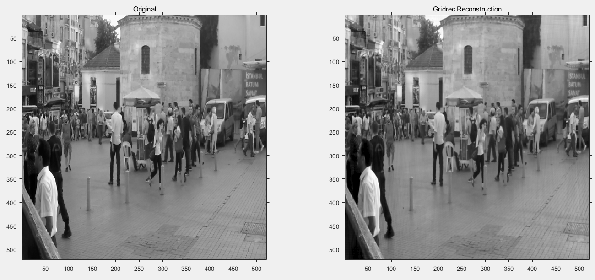
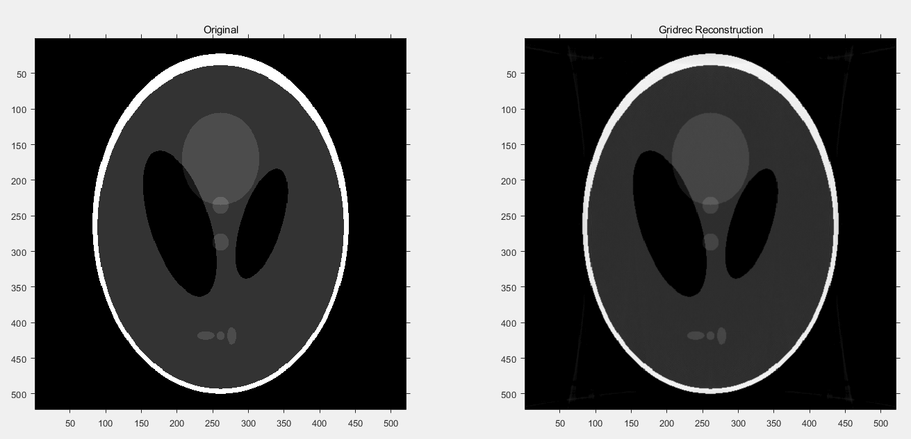
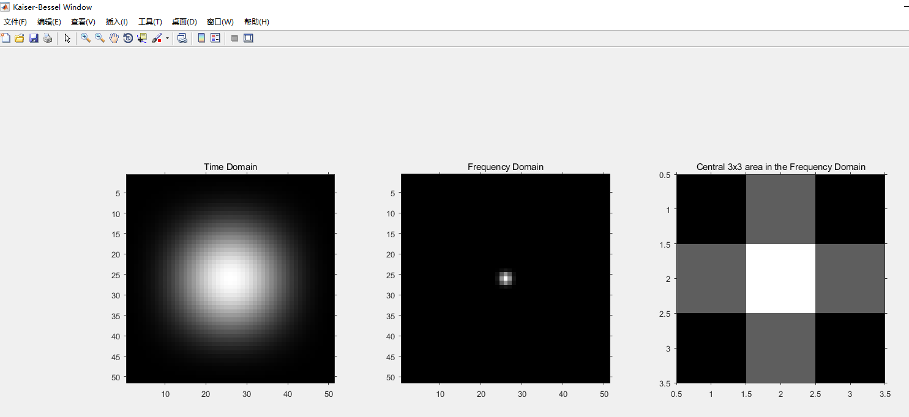

# Regridding

Replicate "Regridding reconstruction algorithm for real-time tomographic imaging".

## Code Structure

The code starts with gridrec_radon.m. The gridrec.m is now deprecated.

The program test_fft_slice.m is a verification of the [Fourier Slice Theorem](https://en.wikipedia.org/wiki/Projection-slice_theorem)  and is not called in  gridrec_radon.m or gridrec.m.

calc_psnr_ssim.m: It calculates the PSNR and SSIM values between two images. It calls metrix_mse.m, metrix_psnr.m, metrix_ssim.m and ssim_index.m.

Kaiser_Bessel_plot.m: Plots the Kaiser_Bessel window. It is based on w_single, w_vector, w_matrix and modified_Bessel.m. It is not called in gridrec.m or gridrec_radon.m.
## Update Logs

Update Aug 23rd:

We successfully implement gridrec_radon.m. Different from gridrec.m, it uses Matlab function "radon" instead of "imrotate" to do projection. Function"radon" employs more parallel beams to perform projection, therefore could considerably reduce the artifacts.

In addition, we test the gridrec algorithm on natural images from the GOPRO dataset which is famous for image deblurring.

Currently the problems are:

1. The gridrec algorithm generates blurry results when the resolution is low.
2. The algorithm is not well parallelized (TODO).

## Experimental Results

### Verification of the Fourier Slice Theorem

The high frequency components (near the start and the end) suffers from great loss if the rotation angle is not close to 0 or $\frac{\pi}{2}$.

### Verification of the Gridrec Algorithm

Gridrec on the GOPRO image:

PSNR = 32.8999, SSIM = 0.9649.

Gridrec on the Shepp-Logan:

PSNR = 32.2522, SSIM = 0.9646.

### Visualization of the Kaiser-Bessel Window

## How to run:

1. If you want to verify the Central Slice Theorem, please run test_fft_slice.m.

2. If you want to acquire high quality reconstruction results, please run gridrec_radon.m.

3. If you want to compare the differences between "imrotate" and "radon", please compare gridrec_radon.m with gridrec.m.
